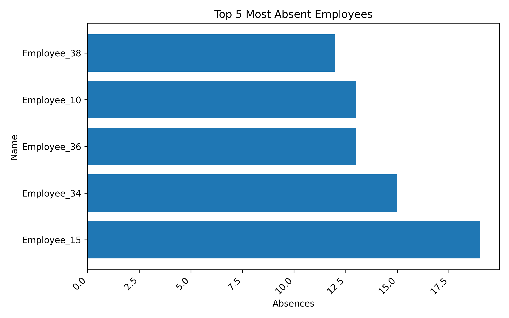
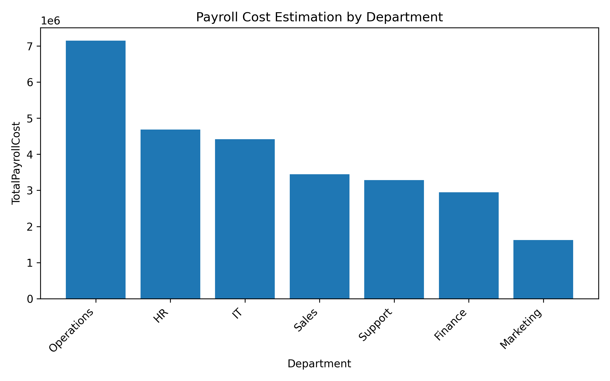

# Workforce Performance Insights (Python + SQL)

A mini HR analytics project that simulates payroll and attendance data, loads it into a relational database (SQLite), and extracts **business insights** using SQL + Python. Visualizations are created with Matplotlib to make the findings recruiter- and manager-friendly.

---

## 🚀 Features
- **Data generation**: Fake HR datasets (employees, attendance logs).
- **Database setup**: Load CSVs into SQLite (`company.db`).
- **Analysis queries** (SQL + Pandas):
  - Attendance summaries
  - Top 5 most absent employees
  - Average overtime by department
  - Payroll cost estimation (base + overtime)
  - Punctuality analysis (late arrivals)
  - Overtime champions
- **Charts** auto-saved in `/charts`.

---

## 📂 Project Structure
```text
PayrollProject/
├── generate_data.py      # Creates sample CSVs
├── setup_db.py           # Loads CSVs into SQLite
├── analysis.py           # Runs SQL queries + charts
├── company.db            # Database 
├── employee_data.csv     # Generated data
├── attendance_data.csv   # Generated data
└── charts/               # Auto-generated PNGs
```


---

## 🖥️ Example Outputs
**Top 5 Most Absent Employees**  


**Payroll Cost by Department**  


---

## ⚙️ How to Run
1. Clone the repo:
   ```bash
   git clone https://github.com/BasementFox069/Workforce-Performance-Insights.git
   cd Workforce-Performance-Insights
